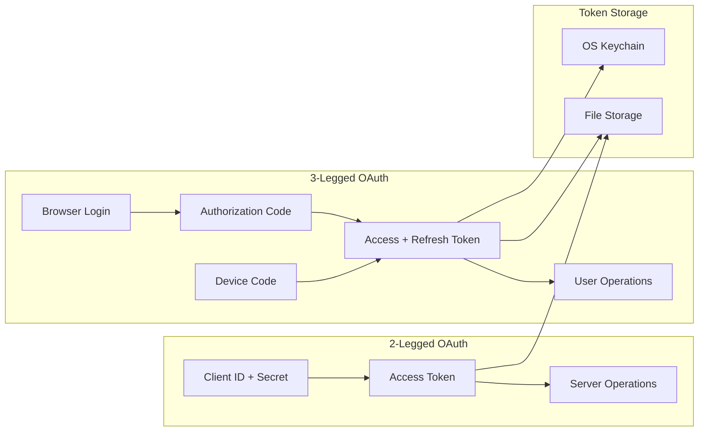
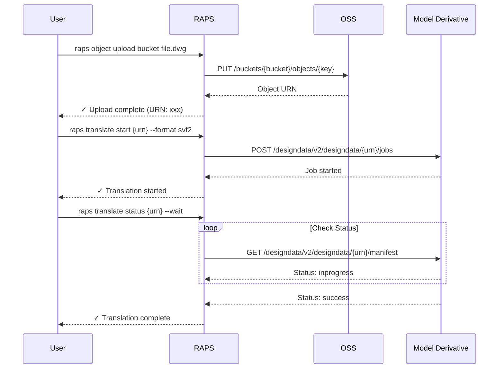
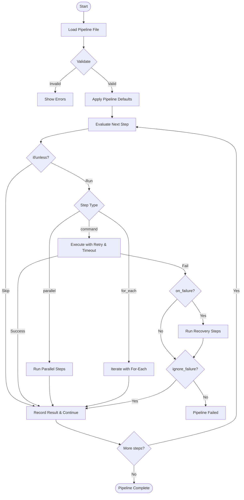
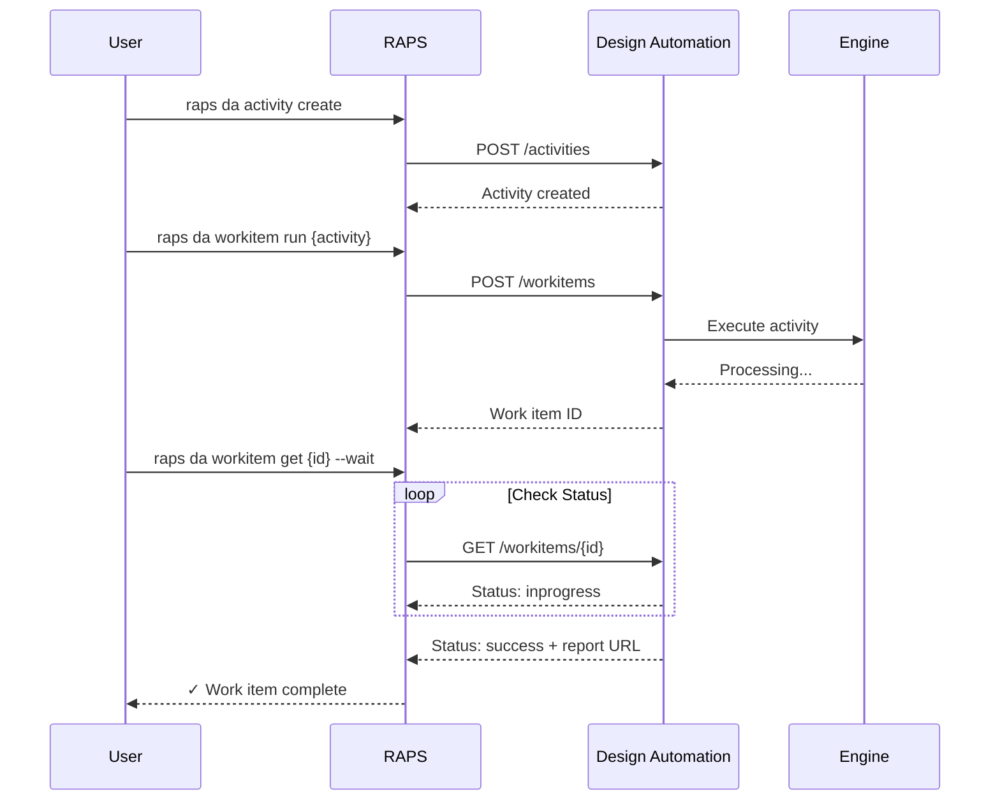

# Feature Overview

This page provides a visual overview of RAPS CLI capabilities and how different components work together.

### 🔍 Full APS Coverage
Detailed comparison of RAPS CLI against available APS services:
- **[APS Feature Coverage](aps-coverage.md)** - See the full matrix of implemented features.

## Command Architecture


```mermaid
graph TB
    subgraph CLI["RAPS CLI"]
        direction TB
        Auth[🔐 auth]
        Bucket[📦 bucket]
        Object[📄 object]
        Translate[🔄 translate]
        Hub[🏢 hub]
        Project[📁 project]
        Folder[📂 folder]
        Item[📎 item]
        Issue[🔧 issue]
        Acc[📋 acc]
        Rfi[❓ rfi]
        Webhook[🔔 webhook]
        DA[⚙️ da]
        RC[📸 reality-capture]
        Pipeline[📋 pipeline]
        Plugin[🧩 plugin]
        Generate[🛠️ generate]
        Demo[🧪 demo]
        Config[⚙️ config]
        Serve[🤖 serve]
    end
    
    subgraph MCP["MCP Server (AI Integration)"]
        direction TB
        MCPAuth[auth_test/status]
        MCPBucket[bucket_*]
        MCPObject[object_*]
        MCPTranslate[translate_*]
        MCPHub[hub_list]
        MCPProject[project_list]
    end

    subgraph APIs["APS APIs"]
        AuthAPI[Authentication API]
        OSSAPI[OSS API]
        MDAPI[Model Derivative API]
        DMAPI[Data Management API]
        IssuesAPI[Issues API]
        WebhooksAPI[Webhooks API]
        DAAPI[Design Automation API]
        RCAPI[Reality Capture API]
    end

    Auth --> AuthAPI
    Bucket --> OSSAPI
    Object --> OSSAPI
    Translate --> MDAPI
    Hub --> DMAPI
    Project --> DMAPI
    Folder --> DMAPI
    Item --> DMAPI
    Issue --> IssuesAPI
    Acc --> IssuesAPI
    Rfi --> IssuesAPI
    Webhook --> WebhooksAPI
    DA --> DAAPI
    RC --> RCAPI
    Pipeline --> CLI
    Plugin --> CLI
    Generate --> CLI
    Demo --> CLI
    Config --> CLI
    Serve --> MCP
    
    MCPAuth --> AuthAPI
    MCPBucket --> OSSAPI
    MCPObject --> OSSAPI
    MCPTranslate --> MDAPI
    MCPHub --> DMAPI
    MCPProject --> DMAPI
```

## Authentication Flow


```mermaid
flowchart LR
    subgraph TwoLeg["2-Legged OAuth"]
        ClientCreds[Client ID + Secret] --> Token2L[Access Token]
        Token2L --> ServerOps[Server Operations]
    end

    subgraph ThreeLeg["3-Legged OAuth"]
        Browser[Browser Login] --> AuthCode[Authorization Code]
        AuthCode --> Token3L[Access + Refresh Token]
        Token3L --> UserOps[User Operations]
        Device[Device Code] --> Token3L
    end

    subgraph Storage["Token Storage"]
        Token2L --> FileStore[File Storage]
        Token3L --> FileStore
        Token3L --> Keychain[OS Keychain]
    end
```

## Feature Matrix

### Core Features

| Feature | Command | Auth Type | Status |
|---------|---------|-----------|--------|
| Bucket Management | `bucket` | 2-legged | ✅ Stable |
| Object Upload | `object upload` | 2-legged | ✅ Stable |
| Multipart Upload | `object upload` (auto) | 2-legged | ✅ Stable |
| Resumable Upload | `object upload --resume` | 2-legged | ✅ New |
| Batch Upload | `object upload --batch` | 2-legged | ✅ New |
| Object Download | `object download` | 2-legged | ✅ Stable |
| Signed URLs | `object signed-url` | 2-legged | ✅ Stable |

### Model Derivative

| Feature | Command | Auth Type | Status |
|---------|---------|-----------|--------|
| Start Translation | `translate start` | 2-legged | ✅ Stable |
| Check Status | `translate status` | 2-legged | ✅ Stable |
| View Manifest | `translate manifest` | 2-legged | ✅ Stable |
| Download Derivatives | `translate download` | 2-legged | ✅ New |
| Translation Presets | `translate preset` | Local | ✅ New |

### Data Management

| Feature | Command | Auth Type | Status |
|---------|---------|-----------|--------|
| List Hubs | `hub list` | 3-legged | ✅ Stable |
| List Projects | `project list` | 3-legged | ✅ Stable |
| List Folders | `folder list` | 3-legged | ✅ Stable |
| Create Folder | `folder create` | 3-legged | ✅ Stable |
| Item Versions | `item versions` | 3-legged | ✅ Stable |
| Bind OSS Object | `item bind` | 3-legged | ✅ New |

### ACC Issues

| Feature | Command | Auth Type | Status |
|---------|---------|-----------|--------|
| List Issues | `issue list` | 3-legged | ✅ Stable |
| Create Issue | `issue create` | 3-legged | ✅ Stable |
| Update Issue | `issue update` | 3-legged | ✅ Stable |
| Issue Types | `issue types` | 3-legged | ✅ Stable |
| Comments | `issue comment` | 3-legged | ✅ Stable |
| Attachments | `issue attachment` | 3-legged | ✅ Stable |
| State Transitions | `issue transition` | 3-legged | ✅ Stable |

### ACC RFIs

| Feature | Command | Auth Type | Status |
|---------|---------|-----------|--------|
| List RFIs | `rfi list` | 3-legged | ✅ Stable |
| Get RFI | `rfi get` | 3-legged | ✅ Stable |
| Create RFI | `rfi create` | 3-legged | ✅ Stable |
| Update RFI | `rfi update` | 3-legged | ✅ Stable |

### ACC Assets

| Feature | Command | Auth Type | Status |
|---------|---------|-----------|--------|
| List Assets | `acc asset list` | 3-legged | ✅ Stable |
| Get Asset | `acc asset get` | 3-legged | ✅ Stable |
| Create Asset | `acc asset create` | 3-legged | ✅ Stable |
| Update Asset | `acc asset update` | 3-legged | ✅ Stable |

### ACC Submittals

| Feature | Command | Auth Type | Status |
|---------|---------|-----------|--------|
| List Submittals | `acc submittal list` | 3-legged | ✅ Stable |
| Get Submittal | `acc submittal get` | 3-legged | ✅ Stable |
| Create Submittal | `acc submittal create` | 3-legged | ✅ Stable |
| Update Submittal | `acc submittal update` | 3-legged | ✅ Stable |

### ACC Checklists

| Feature | Command | Auth Type | Status |
|---------|---------|-----------|--------|
| List Checklists | `acc checklist list` | 3-legged | ✅ Stable |
| Get Checklist | `acc checklist get` | 3-legged | ✅ Stable |
| Create Checklist | `acc checklist create` | 3-legged | ✅ Stable |
| Update Checklist | `acc checklist update` | 3-legged | ✅ Stable |
| List Templates | `acc checklist templates` | 3-legged | ✅ Stable |

### Design Automation

| Feature | Command | Auth Type | Status |
|---------|---------|-----------|--------|
| List Engines | `da engines` | 2-legged | ✅ Stable |
| List App Bundles | `da appbundles` | 2-legged | ✅ Stable |
| Create App Bundle | `da appbundle-create` | 2-legged | ✅ Stable |
| List Activities | `da activities` | 2-legged | ✅ Stable |
| Create Activity | `da activity create` | 2-legged | ✅ New |
| Run Work Item | `da workitem run` | 2-legged | ✅ New |
| Get Work Item | `da workitem get` | 2-legged | ✅ New |
| Work Item Status | `da status` | 2-legged | ✅ Stable |

### Webhooks

| Feature | Command | Auth Type | Status |
|---------|---------|-----------|--------|
| List Webhooks | `webhook list` | 2-legged | ✅ Stable |
| Create Webhook | `webhook create` | 2-legged | ✅ Stable |
| Delete Webhook | `webhook delete` | 2-legged | ✅ Stable |
| List Events | `webhook events` | Local | ✅ Stable |
| Test Endpoint | `webhook test` | None | ✅ New |

### Configuration & Automation

| Feature | Command | Auth Type | Status |
|---------|---------|-----------|--------|
| Profile Management | `config profile` | Local | ✅ Stable |
| Profile Import | `config profile import` | Local | ✅ Stable |
| Profile Export | `config profile export` | Local | ✅ Stable |
| Token Inspection | `auth inspect-token` | Local | ✅ Stable |
| Pipeline Execution | `pipeline run` | Various | ✅ Stable (v2) |
| Pipeline Validation | `pipeline validate` | Local | ✅ Stable (v2) |

### Plugin System

| Feature | Command | Auth Type | Status |
|---------|---------|-----------|--------|
| List Plugins | `plugin list` | Local | ✅ Stable |
| Enable Plugin | `plugin enable` | Local | ✅ Stable |
| Disable Plugin | `plugin disable` | Local | ✅ Stable |
| List Aliases | `plugin alias list` | Local | ✅ Stable |
| Add Alias | `plugin alias add` | Local | ✅ Stable |
| Remove Alias | `plugin alias remove` | Local | ✅ Stable |

### MCP Server (AI Integration)

| Feature | Tool | Auth Type | Status |
|---------|------|-----------|--------|
| Start MCP Server | `serve` | Various | ✅ New (v3.0.0) |
| Test Auth | `auth_test` | 2-legged | ✅ New (v3.0.0) |
| Auth Status | `auth_status` | Various | ✅ New (v3.0.0) |
| List Buckets | `bucket_list` | 2-legged | ✅ New (v3.0.0) |
| Create Bucket | `bucket_create` | 2-legged | ✅ New (v3.0.0) |
| Get Bucket | `bucket_get` | 2-legged | ✅ New (v3.0.0) |
| Delete Bucket | `bucket_delete` | 2-legged | ✅ New (v3.0.0) |
| List Objects | `object_list` | 2-legged | ✅ New (v3.0.0) |
| Delete Object | `object_delete` | 2-legged | ✅ New (v3.0.0) |
| Signed URL | `object_signed_url` | 2-legged | ✅ New (v3.0.0) |
| Get URN | `object_urn` | Local | ✅ New (v3.0.0) |
| Start Translation | `translate_start` | 2-legged | ✅ New (v3.0.0) |
| Translation Status | `translate_status` | 2-legged | ✅ New (v3.0.0) |
| List Hubs | `hub_list` | 3-legged | ✅ New (v3.0.0) |
| List Projects | `project_list` | 3-legged | ✅ New (v3.0.0) |

## Data Flow Diagrams

### Upload and Translate Workflow


```mermaid
sequenceDiagram
    participant User
    participant RAPS
    participant OSS
    participant MD as Model Derivative

    User->>RAPS: raps object upload bucket file.dwg
    RAPS->>OSS: PUT /buckets/{bucket}/objects/{key}
    OSS-->>RAPS: Object URN
    RAPS-->>User: ✓ Upload complete (URN: xxx)

    User->>RAPS: raps translate start {urn} --format svf2
    RAPS->>MD: POST /designdata/v2/designdata/{urn}/jobs
    MD-->>RAPS: Job started
    RAPS-->>User: ✓ Translation started

    User->>RAPS: raps translate status {urn} --wait
    loop Check Status
        RAPS->>MD: GET /designdata/v2/designdata/{urn}/manifest
        MD-->>RAPS: Status: inprogress
    end
    MD-->>RAPS: Status: success
    RAPS-->>User: ✓ Translation complete
```

### Pipeline Execution (v2)


```mermaid
flowchart TD
    Start([Start]) --> Load[Load Pipeline File]
    Load --> Validate{Validate}
    Validate -->|Invalid| Error[Show Errors]
    Validate -->|Valid| Defaults[Apply Pipeline Defaults]
    Defaults --> Step[Evaluate Next Step]
    Step --> Cond{if/unless?}
    Cond -->|Skip| Record[Record Result & Continue]
    Cond -->|Run| Type{Step Type}
    Type -->|command| Retry[Execute with Retry & Timeout]
    Type -->|parallel| Par[Run Parallel Steps]
    Type -->|for_each| ForEach[Iterate with For-Each]
    Retry -->|Success| Record
    Retry -->|Fail| OnFail{on_failure?}
    OnFail -->|Yes| Recovery[Run Recovery Steps]
    OnFail -->|No| Check{ignore_failure?}
    Recovery --> Check
    Par --> Record
    ForEach --> Record
    Check -->|Yes| Record
    Check -->|No| Fail[Pipeline Failed]
    Record --> More{More steps?}
    More -->|Yes| Step
    More -->|No| Complete([Pipeline Complete])
```

#### Pipeline v2 Features

Pipeline v2 adds retry logic, timeouts, conditionals, parallel execution, for-each loops, recovery steps, and pipeline-level defaults.

**Step properties:**

| Property | Type | Description |
|----------|------|-------------|
| `name` | string | Human-readable step name |
| `id` | string | Identifier for referencing exit codes in later steps |
| `command` | string | RAPS command to execute (without `raps` prefix) |
| `parallel` | list | Sub-steps to run concurrently |
| `for_each` | object | Loop over a list of values (`var`, `in`, `parallel`, `max_concurrency`) |
| `if` / `unless` | string | Conditional expression, e.g. `${{ steps.<id>.exit_code == 0 }}` |
| `retry` | object | Retry config: `max_attempts`, `backoff` (fixed/exponential), `delay` |
| `timeout` | string | Max duration for the step (e.g. `30s`, `5m`, `2h`) |
| `on_failure` | list | Recovery steps that run when this step fails |
| `ignore_failure` | bool | Continue pipeline even if this step fails |
| `max_concurrency` | int | Limit concurrent tasks in `parallel` or `for_each` blocks |

**Pipeline-level `defaults`** apply `retry` and `timeout` to all steps unless overridden.

**Example** (YAML):

```yaml
name: Model Processing Pipeline
defaults:
  retry: { max_attempts: 3, backoff: exponential, delay: 5s }
  timeout: 5m
variables:
  BUCKET: my-models

steps:
  - name: Check bucket
    id: check_bucket
    command: bucket info ${BUCKET}
    ignore_failure: true

  - name: Create bucket if missing
    command: bucket create --key ${BUCKET}
    if: "${{ steps.check_bucket.exit_code != 0 }}"

  - name: Upload models in parallel
    parallel:
      - name: Upload building.rvt
        command: object upload ${BUCKET} building.rvt
      - name: Upload site.dwg
        command: object upload ${BUCKET} site.dwg
    max_concurrency: 2

  - name: Translate all models
    for_each:
      var: MODEL
      in: [building.rvt, site.dwg]
      parallel: true
      max_concurrency: 4
    command: translate start urn:${BUCKET}/${MODEL}
    retry: { max_attempts: 2, delay: 10s }
    on_failure:
      - name: Log failure
        command: auth test
```

### Design Automation Workflow


```mermaid
sequenceDiagram
    participant User
    participant RAPS
    participant DA as Design Automation
    participant Engine

    User->>RAPS: raps da activity create
    RAPS->>DA: POST /activities
    DA-->>RAPS: Activity created

    User->>RAPS: raps da workitem run {activity}
    RAPS->>DA: POST /workitems
    DA->>Engine: Execute activity
    Engine-->>DA: Processing...
    DA-->>RAPS: Work item ID

    User->>RAPS: raps da workitem get {id} --wait
    loop Check Status
        RAPS->>DA: GET /workitems/{id}
        DA-->>RAPS: Status: inprogress
    end
    DA-->>RAPS: Status: success + report URL
    RAPS-->>User: ✓ Work item complete
```

## Version History


```mermaid
timeline
    title RAPS CLI Version History
    section v0.4.0
        Profile Management : Create, switch, delete profiles
        Config Commands : Get and set configuration values
    section v0.5.0
        Timeout & Concurrency : CLI flags for fine control
        OS Keychain : Secure token storage option
        Batch Processing : Parallel upload/download
    section v0.6.0
        SBOM Generation : CycloneDX format support
        Checksums : SHA256 verification for releases
        Code of Conduct : Community guidelines
    section v0.7.0
        Multipart Uploads : Resume interrupted uploads
        Derivative Downloads : Export translated models
        Translation Presets : Saved configurations
        Issues Enhancements : Comments, attachments
        Pipeline Execution : YAML/JSON automation
        Token Inspection : Scope and expiry analysis
        Webhook Testing : Endpoint validation
    section v1.0.0
        Stable Release : Backward compatibility guaranteed
        RFI Support : Full CRUD for RFIs
        ACC CRUD : Assets, Submittals, Checklists
        Plugin System : Extensible architecture
    section v2.0.0
        Apache 2.0 License : Better attribution & patents
        Repository Reorganization : Improved maintainability
        APS Coverage Docs : Feature comparison matrix
    section v2.1.0
        Rapeseed Branding : 🌼 RAPS brand identity
        rapscli.xyz : Official website launch
    section v3.0.0
        MCP Server : AI assistant integration
        14 MCP Tools : Direct API access for Claude, Cursor
        Natural Language : Conversational APS operations
    section v3.1.0
        Pipeline v2 : Retry, timeout, conditionals
        Parallel Steps : Concurrent step execution
        For-Each Loops : Iterate over value lists
        Step Outputs : Conditional logic via exit codes
```

## Related Documentation

- [Getting Started](getting-started.md) - Quick start guide
- [Commands](commands/buckets.md) - Complete command reference
- [Configuration](configuration.md) - Setup and profiles
- [Pipelines](commands/pipeline.md) - Automation workflows
- [Exit Codes](cli/exit-codes.md) - Error handling for CI/CD

