# Feature Overview

This page provides a visual overview of RAPS CLI capabilities and how different components work together.

### 🔍 Full APS Coverage
Detailed comparison of RAPS CLI against available APS services:
- **[APS Feature Coverage](aps-coverage.md)** - See the full matrix of implemented features.

## Command Architecture

```mermaid
graph TB
    subgraph CLI["RAPS CLI"]
        direction TB
        Auth[🔐 auth]
        Bucket[📦 bucket]
        Object[📄 object]
        Translate[🔄 translate]
        Hub[🏢 hub]
        Project[📁 project]
        Folder[📂 folder]
        Item[📎 item]
        Issue[🔧 issue]
        Acc[📋 acc]
        Rfi[❓ rfi]
        Webhook[🔔 webhook]
        DA[⚙️ da]
        RC[📸 reality-capture]
        Pipeline[📋 pipeline]
        Plugin[🧩 plugin]
        Generate[🛠️ generate]
        Demo[🧪 demo]
        Config[⚙️ config]
        Serve[🤖 serve]
    end
    
    subgraph MCP["MCP Server (AI Integration)"]
        direction TB
        MCPAuth[auth_test/status]
        MCPBucket[bucket_*]
        MCPObject[object_*]
        MCPTranslate[translate_*]
        MCPHub[hub_list]
        MCPProject[project_list]
    end

    subgraph APIs["APS APIs"]
        AuthAPI[Authentication API]
        OSSAPI[OSS API]
        MDAPI[Model Derivative API]
        DMAPI[Data Management API]
        IssuesAPI[Issues API]
        WebhooksAPI[Webhooks API]
        DAAPI[Design Automation API]
        RCAPI[Reality Capture API]
    end

    Auth --> AuthAPI
    Bucket --> OSSAPI
    Object --> OSSAPI
    Translate --> MDAPI
    Hub --> DMAPI
    Project --> DMAPI
    Folder --> DMAPI
    Item --> DMAPI
    Issue --> IssuesAPI
    Acc --> IssuesAPI
    Rfi --> IssuesAPI
    Webhook --> WebhooksAPI
    DA --> DAAPI
    RC --> RCAPI
    Pipeline --> CLI
    Plugin --> CLI
    Generate --> CLI
    Demo --> CLI
    Config --> CLI
    Serve --> MCP
    
    MCPAuth --> AuthAPI
    MCPBucket --> OSSAPI
    MCPObject --> OSSAPI
    MCPTranslate --> MDAPI
    MCPHub --> DMAPI
    MCPProject --> DMAPI
```

## Authentication Flow

## Feature Matrix

### Core Features

| Feature | Command | Auth Type | Status |
|---------|---------|-----------|--------|
| Bucket Management | `bucket` | 2-legged | ✅ Stable |
| Object Upload | `object upload` | 2-legged | ✅ Stable |
| Multipart Upload | `object upload` (auto) | 2-legged | ✅ Stable |
| Resumable Upload | `object upload --resume` | 2-legged | ✅ New |
| Batch Upload | `object upload --batch` | 2-legged | ✅ New |
| Object Download | `object download` | 2-legged | ✅ Stable |
| Signed URLs | `object signed-url` | 2-legged | ✅ Stable |

### Model Derivative

| Feature | Command | Auth Type | Status |
|---------|---------|-----------|--------|
| Start Translation | `translate start` | 2-legged | ✅ Stable |
| Check Status | `translate status` | 2-legged | ✅ Stable |
| View Manifest | `translate manifest` | 2-legged | ✅ Stable |
| Download Derivatives | `translate download` | 2-legged | ✅ New |
| Translation Presets | `translate preset` | Local | ✅ New |

### Data Management

| Feature | Command | Auth Type | Status |
|---------|---------|-----------|--------|
| List Hubs | `hub list` | 3-legged | ✅ Stable |
| List Projects | `project list` | 3-legged | ✅ Stable |
| List Folders | `folder list` | 3-legged | ✅ Stable |
| Create Folder | `folder create` | 3-legged | ✅ Stable |
| Item Versions | `item versions` | 3-legged | ✅ Stable |
| Bind OSS Object | `item bind` | 3-legged | ✅ New |

### ACC Issues

| Feature | Command | Auth Type | Status |
|---------|---------|-----------|--------|
| List Issues | `issue list` | 3-legged | ✅ Stable |
| Create Issue | `issue create` | 3-legged | ✅ Stable |
| Update Issue | `issue update` | 3-legged | ✅ Stable |
| Issue Types | `issue types` | 3-legged | ✅ Stable |
| Comments | `issue comment` | 3-legged | ✅ Stable |
| Attachments | `issue attachment` | 3-legged | ✅ Stable |
| State Transitions | `issue transition` | 3-legged | ✅ Stable |

### ACC RFIs

| Feature | Command | Auth Type | Status |
|---------|---------|-----------|--------|
| List RFIs | `rfi list` | 3-legged | ✅ Stable |
| Get RFI | `rfi get` | 3-legged | ✅ Stable |
| Create RFI | `rfi create` | 3-legged | ✅ Stable |
| Update RFI | `rfi update` | 3-legged | ✅ Stable |

### ACC Assets

| Feature | Command | Auth Type | Status |
|---------|---------|-----------|--------|
| List Assets | `acc asset list` | 3-legged | ✅ Stable |
| Get Asset | `acc asset get` | 3-legged | ✅ Stable |
| Create Asset | `acc asset create` | 3-legged | ✅ Stable |
| Update Asset | `acc asset update` | 3-legged | ✅ Stable |

### ACC Submittals

| Feature | Command | Auth Type | Status |
|---------|---------|-----------|--------|
| List Submittals | `acc submittal list` | 3-legged | ✅ Stable |
| Get Submittal | `acc submittal get` | 3-legged | ✅ Stable |
| Create Submittal | `acc submittal create` | 3-legged | ✅ Stable |
| Update Submittal | `acc submittal update` | 3-legged | ✅ Stable |

### ACC Checklists

| Feature | Command | Auth Type | Status |
|---------|---------|-----------|--------|
| List Checklists | `acc checklist list` | 3-legged | ✅ Stable |
| Get Checklist | `acc checklist get` | 3-legged | ✅ Stable |
| Create Checklist | `acc checklist create` | 3-legged | ✅ Stable |
| Update Checklist | `acc checklist update` | 3-legged | ✅ Stable |
| List Templates | `acc checklist templates` | 3-legged | ✅ Stable |

### Design Automation

| Feature | Command | Auth Type | Status |
|---------|---------|-----------|--------|
| List Engines | `da engines` | 2-legged | ✅ Stable |
| List App Bundles | `da appbundles` | 2-legged | ✅ Stable |
| Create App Bundle | `da appbundle-create` | 2-legged | ✅ Stable |
| List Activities | `da activities` | 2-legged | ✅ Stable |
| Create Activity | `da activity create` | 2-legged | ✅ New |
| Run Work Item | `da workitem run` | 2-legged | ✅ New |
| Get Work Item | `da workitem get` | 2-legged | ✅ New |
| Work Item Status | `da status` | 2-legged | ✅ Stable |

### Webhooks

| Feature | Command | Auth Type | Status |
|---------|---------|-----------|--------|
| List Webhooks | `webhook list` | 2-legged | ✅ Stable |
| Create Webhook | `webhook create` | 2-legged | ✅ Stable |
| Delete Webhook | `webhook delete` | 2-legged | ✅ Stable |
| List Events | `webhook events` | Local | ✅ Stable |
| Test Endpoint | `webhook test` | None | ✅ New |

### Configuration & Automation

| Feature | Command | Auth Type | Status |
|---------|---------|-----------|--------|
| Profile Management | `config profile` | Local | ✅ Stable |
| Profile Import | `config profile import` | Local | ✅ Stable |
| Profile Export | `config profile export` | Local | ✅ Stable |
| Token Inspection | `auth inspect-token` | Local | ✅ Stable |
| Pipeline Execution | `pipeline run` | Various | ✅ Stable |
| Pipeline Validation | `pipeline validate` | Local | ✅ Stable |

### Plugin System

| Feature | Command | Auth Type | Status |
|---------|---------|-----------|--------|
| List Plugins | `plugin list` | Local | ✅ Stable |
| Enable Plugin | `plugin enable` | Local | ✅ Stable |
| Disable Plugin | `plugin disable` | Local | ✅ Stable |
| List Aliases | `plugin alias list` | Local | ✅ Stable |
| Add Alias | `plugin alias add` | Local | ✅ Stable |
| Remove Alias | `plugin alias remove` | Local | ✅ Stable |

### MCP Server (AI Integration)

| Feature | Tool | Auth Type | Status |
|---------|------|-----------|--------|
| Start MCP Server | `serve` | Various | ✅ Updated (v4.0.0) |
| Test Auth | `auth_test` | 2-legged | ✅ Updated (v4.0.0) |
| Auth Status | `auth_status` | Various | ✅ Updated (v4.0.0) |
| List Buckets | `bucket_list` | 2-legged | ✅ Updated (v4.0.0) |
| Create Bucket | `bucket_create` | 2-legged | ✅ Updated (v4.0.0) |
| Get Bucket | `bucket_get` | 2-legged | ✅ Updated (v4.0.0) |
| Delete Bucket | `bucket_delete` | 2-legged | ✅ Updated (v4.0.0) |
| List Objects | `object_list` | 2-legged | ✅ Updated (v4.0.0) |
| Delete Object | `object_delete` | 2-legged | ✅ Updated (v4.0.0) |
| Signed URL | `object_signed_url` | 2-legged | ✅ Updated (v4.0.0) |
| Get URN | `object_urn` | Local | ✅ Updated (v4.0.0) |
| Start Translation | `translate_start` | 2-legged | ✅ Updated (v4.0.0) |
| Translation Status | `translate_status` | 2-legged | ✅ Updated (v4.0.0) |
| List Hubs | `hub_list` | 3-legged | ✅ Updated (v4.0.0) |
| List Projects | `project_list` | 3-legged | ✅ Updated (v4.0.0) |

## Data Flow Diagrams

### Upload and Translate Workflow

### Pipeline Execution

### Design Automation Workflow

## Version History

```mermaid
timeline
    title RAPS CLI Version History
    section v0.4.0
        Profile Management : Create, switch, delete profiles
        Config Commands : Get and set configuration values
    section v0.5.0
        Timeout & Concurrency : CLI flags for fine control
        OS Keychain : Secure token storage option
        Batch Processing : Parallel upload/download
    section v0.6.0
        SBOM Generation : CycloneDX format support
        Checksums : SHA256 verification for releases
        Code of Conduct : Community guidelines
    section v0.7.0
        Multipart Uploads : Resume interrupted uploads
        Derivative Downloads : Export translated models
        Translation Presets : Saved configurations
        Issues Enhancements : Comments, attachments
        Pipeline Execution : YAML/JSON automation
        Token Inspection : Scope and expiry analysis
        Webhook Testing : Endpoint validation
    section v1.0.0
        Stable Release : Backward compatibility guaranteed
        RFI Support : Full CRUD for RFIs
        ACC CRUD : Assets, Submittals, Checklists
        Plugin System : Extensible architecture
    section v2.0.0
        Apache 2.0 License : Better attribution & patents
        Repository Reorganization : Improved maintainability
        APS Coverage Docs : Feature comparison matrix
    section v2.1.0
        Rapeseed Branding : 🌼 RAPS brand identity
        rapscli.xyz : Official website launch
    section v3.0.0
        MCP Server : AI assistant integration
        14 MCP Tools : Direct API access for Claude, Cursor
        Natural Language : Conversational APS operations
```

## Related Documentation

- [Getting Started](getting-started.md) - Quick start guide
- [Commands](commands/buckets.md) - Complete command reference
- [Configuration](configuration.md) - Setup and profiles
- [Pipelines](commands/pipeline.md) - Automation workflows
- [Exit Codes](cli/exit-codes.md) - Error handling for CI/CD

