# Feature Overview

This page provides a visual overview of RAPS CLI capabilities and how different components work together.

## Command Architecture

```mermaid
graph TB
    subgraph CLI["RAPS CLI"]
        direction TB
        Auth[🔐 auth]
        Bucket[📦 bucket]
        Object[📄 object]
        Translate[🔄 translate]
        Hub[🏢 hub]
        Project[📁 project]
        Folder[📂 folder]
        Item[📎 item]
        Issue[🔧 issue]
        Webhook[🔔 webhook]
        DA[⚙️ da]
        RC[📸 reality-capture]
        Pipeline[📋 pipeline]
        Config[⚙️ config]
    end

    subgraph APIs["APS APIs"]
        AuthAPI[Authentication API]
        OSSAPI[OSS API]
        MDAPI[Model Derivative API]
        DMAPI[Data Management API]
        IssuesAPI[Issues API]
        WebhooksAPI[Webhooks API]
        DAAPI[Design Automation API]
        RCAPI[Reality Capture API]
    end

    Auth --> AuthAPI
    Bucket --> OSSAPI
    Object --> OSSAPI
    Translate --> MDAPI
    Hub --> DMAPI
    Project --> DMAPI
    Folder --> DMAPI
    Item --> DMAPI
    Issue --> IssuesAPI
    Webhook --> WebhooksAPI
    DA --> DAAPI
    RC --> RCAPI
    Pipeline --> CLI
    Config --> CLI
```

## Authentication Flow

## Feature Matrix

### Core Features

| Feature | Command | Auth Type | Status |
|---------|---------|-----------|--------|
| Bucket Management | `bucket` | 2-legged | ✅ Stable |
| Object Upload | `object upload` | 2-legged | ✅ Stable |
| Multipart Upload | `object upload` (auto) | 2-legged | ✅ Stable |
| Resumable Upload | `object upload --resume` | 2-legged | ✅ New |
| Batch Upload | `object upload --batch` | 2-legged | ✅ New |
| Object Download | `object download` | 2-legged | ✅ Stable |
| Signed URLs | `object signed-url` | 2-legged | ✅ Stable |

### Model Derivative

| Feature | Command | Auth Type | Status |
|---------|---------|-----------|--------|
| Start Translation | `translate start` | 2-legged | ✅ Stable |
| Check Status | `translate status` | 2-legged | ✅ Stable |
| View Manifest | `translate manifest` | 2-legged | ✅ Stable |
| Download Derivatives | `translate download` | 2-legged | ✅ New |
| Translation Presets | `translate preset` | Local | ✅ New |

### Data Management

| Feature | Command | Auth Type | Status |
|---------|---------|-----------|--------|
| List Hubs | `hub list` | 3-legged | ✅ Stable |
| List Projects | `project list` | 3-legged | ✅ Stable |
| List Folders | `folder list` | 3-legged | ✅ Stable |
| Create Folder | `folder create` | 3-legged | ✅ Stable |
| Item Versions | `item versions` | 3-legged | ✅ Stable |
| Bind OSS Object | `item bind` | 3-legged | ✅ New |

### ACC Issues

| Feature | Command | Auth Type | Status |
|---------|---------|-----------|--------|
| List Issues | `issue list` | 3-legged | ✅ Stable |
| Create Issue | `issue create` | 3-legged | ✅ Stable |
| Update Issue | `issue update` | 3-legged | ✅ Stable |
| Issue Types | `issue types` | 3-legged | ✅ Stable |
| Comments | `issue comment` | 3-legged | ✅ New |
| Attachments | `issue attachment` | 3-legged | ✅ New |
| State Transitions | `issue transition` | 3-legged | ✅ New |

### Design Automation

| Feature | Command | Auth Type | Status |
|---------|---------|-----------|--------|
| List Engines | `da engines` | 2-legged | ✅ Stable |
| List App Bundles | `da appbundles` | 2-legged | ✅ Stable |
| Create App Bundle | `da appbundle-create` | 2-legged | ✅ Stable |
| List Activities | `da activities` | 2-legged | ✅ Stable |
| Create Activity | `da activity create` | 2-legged | ✅ New |
| Run Work Item | `da workitem run` | 2-legged | ✅ New |
| Get Work Item | `da workitem get` | 2-legged | ✅ New |
| Work Item Status | `da status` | 2-legged | ✅ Stable |

### Webhooks

| Feature | Command | Auth Type | Status |
|---------|---------|-----------|--------|
| List Webhooks | `webhook list` | 2-legged | ✅ Stable |
| Create Webhook | `webhook create` | 2-legged | ✅ Stable |
| Delete Webhook | `webhook delete` | 2-legged | ✅ Stable |
| List Events | `webhook events` | Local | ✅ Stable |
| Test Endpoint | `webhook test` | None | ✅ New |

### Configuration & Automation

| Feature | Command | Auth Type | Status |
|---------|---------|-----------|--------|
| Profile Management | `config profile` | Local | ✅ Stable |
| Profile Import | `config profile import` | Local | ✅ New |
| Profile Export | `config profile export` | Local | ✅ New |
| Token Inspection | `auth inspect-token` | Local | ✅ New |
| Pipeline Execution | `pipeline run` | Various | ✅ New |
| Pipeline Validation | `pipeline validate` | Local | ✅ New |

## Data Flow Diagrams

### Upload and Translate Workflow

### Pipeline Execution

### Design Automation Workflow

## Version History

## Related Documentation

- [Getting Started](getting-started.md) - Quick start guide
- [Commands](commands/buckets.md) - Complete command reference
- [Configuration](configuration.md) - Setup and profiles
- [Pipelines](commands/pipeline.md) - Automation workflows
- [Exit Codes](cli/exit-codes.md) - Error handling for CI/CD

